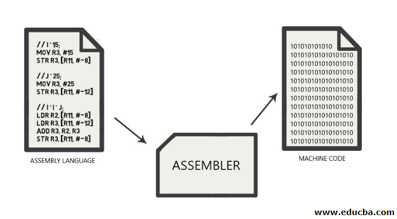
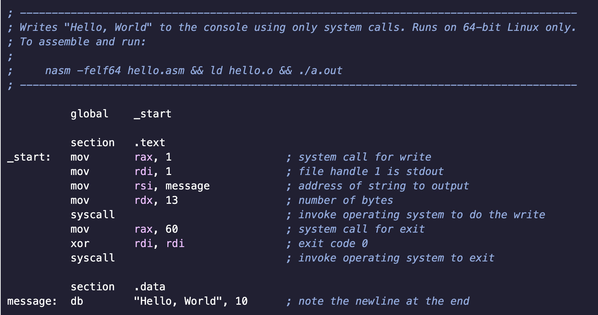

# C Code Tutorial
9/5/2019 <br>
by Daniel Darcy

### Index  
- [Section 1 - ANSI Standard C and GCC](#ANSI Standard C and GCC)  
- [Section 2 - Storage Sizes and Binary Representations of Contents](#Storage Sizes and Binary Representations of Contents)  
- [Section 3 - Unsigned Numbers](#Unsigned Numbers)  
- [Section 4 - ASCII Codes](#ASCII Codes)  
- [Section 5 - Machine Code](#Machine Code)  
- [Section 6 - Signed Numbers](#Signed Numbers)  
- [Section 7 - IEEE Floating Point](#IEEE Floating Point)  
- [Section 8 - Using printf](#Using printf)
- [Section 9 - Memcpy()](#Memcpy)
- [Refrences](#Refrences)  
<br>


### Introduction
  This is a introductory coding tutorial for students learning C. Many important aspects of the C language will be outlined and explained in this tutorial. The main topics will include storage, binary representations, unsigned numbers, signed numbers, ASCII codes, machine codes, two's compliment, IEEE floating point, precision, and accuracy.

--------

### ANSI Standard C and GCC <a name="ANSI Standard C and GCC"></a> 
  **ANSI** and **GCC** are two things every computer science major should be familiar with. ANSI is an acronym for American National Standards Institute, that is the organization which sets the national standards for products, services, processes, systems, and personnel in the United States. GCC is an acronym for GNU Compiler Collection. GCC is a key componet and standard compiler for most projects written for Linux, including the Linux kernel. 
  
      "For many years, the definition of C was the refrence manual in the first edition of The C Programming Language. In 1983, the American National Standards Institute (ANSI) established a committee to provide a modern comprehensive definition of C. The resulting definition, the ANSI standard, or "ANSI C," was completed late in 1988. Most features of the standard are already supported by modern compilers."       

    - Kernighan & Ritchie

<br>

####  Timeline of Different C Standards

  |Name|Release Year|Description|
  |------|-----------|-----------------------------------------------------|
  |c89|1989|The first C Standard commonly called "ANSI C".|
  |c90|1990|Only difference from c89 is format changes.|
  |c95|1995|Corrections and minor improvements to c90.|
  |c99|1999|Added data types and header files for better programming.|
  |c11|2011|Added unicode support and type generic expressions usering _GENERIC.|
  |c18|2018|Minor imporvements to c11.|
<br>

-----

### Storage Sizes and Binary Representations of Contents <a name="Storage Sizes and Binary Representations of Contents"></a>
  In C there are various different data types for storing numbers. Some data types are more complicated than others but for now we will just focus on the simple ones. All numbers are stored in binary form on computers since everything must be in terms of on or off but different data types have different ranges. Each byte consists of 8 different bits. Each bit can either be on or off (T or F). Even octal and hex values must be converted to binary for storage. The reason different data types have different ranges is due to their storage space. <br>
  Also binary numbers can be either big endian or little endian. Big endian means the most significant bits are stored at the end and little indian means the least significant bits will be stored in the end (with the end being the right side).
Big endian is usually used in networking protocols and little endian is usually used for processor architects and their memory. We will be working with little endian.
  
    bitstring = 00000001
    
    Big endian value = 256
    Little endian value = 1

<br>
  Storage space for numeric data types in C ranges from 1-8 bytes (8-64 bits!). The **smallest data type** is a char, it uses one byte of storage. The **largest data type** is a long, it uses 8 bytes of storage. There are some data types inbetween char and long such as short and int. Shorts cost 2 bytes to store and ints cost either 2 or 4 bytes to store depending on computer specifications. There is a chart below which lists simple unsigned numeric types, ranges, and storage size. Although there is no binary, octal, or hex type these datatypes can still be used and stored as integers as long as the correct prefix is used. The prefixes are 0b, 0, and 0x respectively.
  
```C
//bohAssignment.c

#include <stdio.h>
  
int main(int argc, const char* argv[]){

  int binary = 0b00000010;		//Binary value for 2
  int octal = 010;					//Octal value for 8
  int hex = 0x0010;				//Hex value for 16
  
  printf("\nBinary = %d", binary);
  printf("\nOctal = %d", octal);
  printf("\nHex = %d\n\n", hex);
}
```

```
Output:
Binary = 2
Octal = 8
Hex = 16
```
<br>

#### Byte Addressing
  As mentioned earlier there are 8 bits in a byte. One byte can be represented by a hexadecimal digit ranging from 0-f. When declaring any variable that is size 1 byte, byte addressing is used. For this example the char datatype will be used. For each char declared 1 byte of memory is allocated therefore the hexadecimal address will be incremented by one byte (if declared consecutively). This is illustrated in the example below.
  
```C
//byteAddressing.c
#include <stdio.h>

int main()
{
	char a = 'a';
	char b = 'b';
	char c = 'c';

	printf("The address of a is %p", &a);
	printf("\nThe address of b is %p", &b);
	printf("\nThe address of c is %p\n", &c);

	return 0;
}
```

```
Output:
The address of a is 0x7ffeef5f95bb
The address of b is 0x7ffeef5f95ba
The address of c is 0x7ffeef5f95b9
```
  
<br>

#### Word Addressing
  A word is the amount of data that a machine can process at one time. In other words the size of a processor's general purpose register is equal to its word size. Based on this definition a word can be 32 bits or 64 bits depending on your machines processor. So unlike byte addressing, word addresses either increment by 4 or 8 bytes for each allocated variable. this is illustrated in the example below.
  
```C
//wordAddressing.c
#include <stdio.h>

int main(){

	int a = 1;
	int b = 2;
	int c = 3;

	printf("The address of a is %p", &a);
	printf("\nThe address of b is %p", &b);
	printf("\nThe address of c is %p\n", &c);

	return 0;
}
```

```
Output:
The address of a is 0x7ffee3a845b8
The address of b is 0x7ffee3a845b4
The address of c is 0x7ffee3a845b0

```
  
<br>

-----

### Unsigned Numbers <a name="Unsigned Numbers"></a> 
  Numbers can either be positive, negative, or 0. With unsigned numbers we are only worried about positive numbers and 0. In C all unsigned numbers are stored in binary form. To find the range for a specific unsigned data type we must know how many bytes of storage the data type uses. Multiply the number of bytes by 8 (8 bits in a byte) and raise 2 to that number. For example what is the range of an unsigned char?<br>
  
----------------------
  
  - As mentioned above a char uses 1 byte for storage.
  - $1 \times 8$ = $8$
  - 2<sup>8</sup> = $256$ (-1 for 0)
  - Range = $0-255$
  
---------------------

  It is worth noting that since integers are used to store binary, octal, and hexidecimal values their range depends on the size of an int on your specific system (2 or 4 bytes).
<br>  
  There are 5 different arithmetic **operators used in C**. These operators include addition (+), subtraction (-), multiplication (*), division (/), and modulus or remainder (%). As many of us learned in CS 3240 we know addition and subraction are simple arithmetic but multiplication and division are too in a sense. Multiplication is completed through repeated addition. Modulus and division are completed through repeated subtraction.
<br>  
<br>

#### Unsigned Overflow
  Unsigned data types have a range, what happens if that range is exceeded? This is **overflow**. In C when an unsigned data type exceeds its maximum value it does not overflow it "wraps around". For example, if you take the maximum number which can be stored for some data type and add 1 to it the result would be 0. Add 2 and the result would be 1, etc, etc. Refer below for a more clear example.
<br><br>

```C
//unsignedFlow.c

#include <stdio.h>
#include <limits.h>

int main( int argc, const char* argv[] ){
	unsigned int max = INT_MAX;
	unsigned int min = 0;
	
	printf("max = %d", max);			//Show max is sotred correctly
	printf("\nmin = %d", min);		//Show min is stored correctly
	max = max+1;
	min = min-1;
	printf("\nOverflow (max+1) = %d\n", max);		//Result of subtracting 1 from min
	printf("Underflow (min-1) = %d\n\n", min);	//Result of adding 1 to max
}
```

```
Output:
max = 2147483647
min = 0
Overflow (max+1) = -2147483648
Underflow (min-1) = -1
```
<br>
<br>

#### Unsigned Division by 0
  The case of overflow in unsigned datatypes has been covered, now lets consider the case **dividing by 0**. In C integer division of 0/0 is said to invoke undefined behavior. This means there could be many different results based on your specific system. In some cases results can be a nan, which is short for "Not a Number". Any operation performed on a nan will produce a nan. In C there can also be some other special "values". We will go more into detail with these results in the IEEE Floating Point Section. Below is my results from division by 0 on my system.
  
  
```C
//IntZeroDivision.c

#include <stdio.h>

int main(int argc, const char* argv[]){
	unsigned int result1 = 0/0, result2 = 10/0, result3 = 0/10;

	printf("\nzero/zero = %d", result1);
	printf("\nten/zero = %d", result2);
	printf("\nzero/ten = %d\n\n", result3);
}
```

```
Output:
zero/zero = -490752296
ten/zero = 73896
zero/ten = 0
```
<br>

####  Unsigned Data Types

  |Type	|Storage size	|Value range|
|------------------|-------------------|----------------------------------------------|
|unsigned char	|1 byte	|0 to 255|
|unsigned int	|2 or 4 bytes	|0 to 65,535 or 0 to 4,294,967,295|
|unsigned short	|2 bytes	|0 to 65,535|
|unsigned long	|8 bytes	|0 to 18446744073709551615|

<br>

-----

### ASCII Codes <a name="ASCII Codes"></a> 
  ASCII stands for American Standard Code for Information Interchange. ASCII is a 7-bit character code where every bit represents some unique character. ASCII was developed for telegraph code by Bell Data Services and has since been adapted for computer systems. ASCII codes represent printable characters and control characters. Printable characters are the focus here. The control characters were created for controlling certain devices and consist of the first 32 characters on the below ASCII table. Since ASCII codes are just numbers that represent characters they can also be converted to binary, decimal, and even octal numbers.
  
<br>


<br>
<br>

-----

### Machine Code <a name="Machine Code"></a> 
  Machine code is a language which can be read by a CPU. All CPUs have their own specific language though they are all very similar. When a C program is compiled it is translated into machine code. The machine code is then saved on a file which we know as an executable. This executable file (machine code) is fed into the CPU when the user runs the program.
  
  Mahcine code can be represented in binary or hexadecimal since hexadecimal is just a more compact version of binary. **Assembly language** is an easier to read version of machine code. An assembler is used to convert assembly language to machine code. Refer to the illustrations below to observe what assembly code looks like.


<br>
<br>

#### x86 Assembly Code


<br>
<br>

#### MSP430 Assembly Code (CS3240)
```
public mul_horner_int
       
RSEG CODE
       
mul_horner_int

            mov.w     R12,R13               ; The operand "input" in register R12
            rla.w     R13            
            add.w     R12,R13               ; X1=X*2^1+X
            rla.w     R13
            rla.w     R13
            add.w     R12,R13               ; X2=X1*2^2+X
            rla.w     R13
            add.w     R12,R13               ; X3=X2*2^1+X
            rla.w     R13
            add.w     R12,R13               ; X4=X4*2^1+X
            rla.w     R13
            rla.w     R13
            rla.w     R13
            add.w     R12,R13               ; Final Result=X5=X4*2^3+X
            mov.w     R13,R12               ; The final answer returned to the
                                            ; calling function
            ret
            END

```
<br>
<br>

    NOTE:
    When changing a number from decimal to binary all you are really doing is changing the way that number will be represented. In this example changing the number from base 10 (digits range 0-9) to base 2 (digits range 0-1) does not change the number being represented. Computers use base 2 numbers because everything is stored in terms of on and off but hexadecimal and octal are also commonly used in computing as a compact way of representing binary numbers.
   
    - Binary      Base2       (0-1)
    - Octal       Base8       (0-7)
    - Hex         Base16      (0-F)
    - Decimal     Base10      (0-9)
    
<br>

#### N Z V C Flags
  In assembly language there are special bits used to indicate the state of an answer after an operation has been carried out on two values. These bits are known as N, Z, V, and C. These flags (or bits) are explained more thoroughly below.
  
      N = Negative bit -> answer is negative
      Z = Zero bit -> answer is zero
      V = Overflow bit -> answer is to big of value for memory
      C = Carry bit -> if operation produced a carry (borrow on subtraction)
      
      An example: (with hex values)
      AC + 8A = 36
      
      N = 0
      Z = 0
      V = 1
      C = 1

<br>
<br>

-----

### Signed Numbers (two's complement) <a name="Signed Numbers"></a>
  We have talked about unsigned numbers and now it is time for signed numbers. In C all signed numbers are stored in binary form. To find the range for a specific signed data type we must know how many bytes of storage the data type uses. Multiply the number of bytes by 8 (8 bits in a byte) and raise 2 to that number. This will give you the number of values but we still have to account for negative values. In order to account for negative values we must take this result and divide it by 2. This will give us the range for both positive and negative values. For example what is the range of a signed char?<br>

--------------

  - As mentioned above a char uses 1 byte for storage.
  - $1 \times 8$ = $8$
  - 2<sup>8</sup> = $256$ (-1 for 0)
  - $256/2$ = $128$
  - Range = $-128$ to $127$
  
--------------

  Interesting right? Similar to the unsigned char the signed char can hold 256 different values. The difference is that instead of ranging from 0-255 the unsigned values range from -127 to 128. This is possible and works out nicely because unsigned numbers are stored as two's complement. To convert a number from positive to negative (two's compliment) all we have to do is invert all of the bits of that positive number and add 1 to the result. Check out the example below.
  
  Conversion from positive binary number to negative two's complement binary number:
<br>

--------------

  1. Convert ``1`` to ``-1`` (8-bit)
  2. ``1`` in binary -> ``00000001``
  3. Invert all bits -> ``11111110``
  4. Add ``1`` to inversion: (this is independent of step 2, always add 1)<br>
  ``11111110`` <br>
  ``00000001`` <br>
  ---------------- <br>
  ``11111111`` AKA ``-1`` <br> <br>
  

  Example: 4 and -4 (32 bit) <br>
  ``00000000 00000000 00000000 00000100`` = ``4`` <br>
  ``10000000 00000000 00000000 00000100`` = ``-4``
  
--------------  

<br>

#### Signed Overflow
  Signed data types have a range, what happens if that range is exceeded? Thats right time to talk about **overflow** again. In C when there is overflow in some signed data type it leads to undefined behavior. In other words it will cause problems. Could be a simple program crash, infinite loop, the value could wrap around, value could stay at maximum, or a dozen other random results. UNDEFINED BEHAVIOR. My sytems results are below.
  
```C
//signedFlow.c

#include <stdio.h>
#include <limits.h>

int main( int argc, const char* argv[] ){
	signed int max = INT_MAX;
	signed int min = INT_MIN;
	printf("max = %d", max);			//Show max is stored correctly
	printf("\nmin = %d", min);		//Show min is stored correctly

	max = max+1;
	min = min-1;
	printf("\nOverflow (max+1) = %d\n", max);		//Result of subtracting 1 from min
	printf("Underflow (min-1) = %d\n\n", min);	//Result of adding 1 to max
}
```  

```
Output:
max = 2147483647
min = -2147483648
Overflow (max+1) = -2147483648
Underflow (min-1) = 2147483647
```
<br>
<br>

#### Signed Division by 0
Now lets consider the case **dividing by 0**. This is the same as it was in unsigned data types. Integer division by 0 also envokes undefined behavior. My results are below.

```C
//signedZeroDivision.c

#include <stdio.h>

int main(int argc, const char* argv[]){
	signed int result1 = 0/0, result2 = 10/0, result3 = 0/10;

	printf("\nzero/zero = %d", result1);
	printf("\nten/zero = %d", result2);
	printf("\nzero/ten = %d\n\n", result3);
}
```

```
Output:
zero/zero = -474114344
ten/zero = 73896
zero/ten = 0
```

  Just like unsigned data types signed binary, octal, and hexidecimal values are input as ints with their specific prefixes 0b, 0, and 0x respectively. Decimal has no prefix you just simply input the desired value.

<br>  

####  Signed Data Types

  |Type	|Storage size	|Value range|
|------------------|-------------------|----------------------------------------------|
|signed char |1 byte|-128 to 127|
|signed int	|2 or 4 bytes	|-32,768 to 32,767 or -2,147,483,648 to 2,147,483,647|
|signed short	|2 bytes	|-32,768 to 32,767|
|signed long	|8 bytes	|-9,223,372,036,854,775,808 to 9,223,372,036,854,775,807|

<br>

-----

### IEEE Floating Point <a name="IEEE Floating Point"></a>
  Signed and unsigned numbers have been covered now lets look into IEEE floating points. Floating points can be positive or negative and are stored alot differently than all of the other data types we have looked at so far. Because of this unique storage each floating point type has a **precision** measured in decimal places. Precision is the number of digits specified where **accuracy** is how close a number is to the true result. 3.14 is less precise than 3.149 but more accurate if we are comparing it to the value of pi (3.1459).  The floating point types with the highest range have the most precision.
<br><br>
    Floating points have a massive range of values. There is a table below that shows the actual ranges and precision of different floating point types. Take a look. All floating points are stored in a specific form. This form is $m \times b$<sup>e</sup>. The variables are as follows:
    
    - m = significand (fractional part)
    - b = base
    - e = exponet

<br>

#### Normalized Values
  A floating point number is said to be normalized when the integer part of the significand is exactly 1. For example the number 13.25 written in binary would be 1101.01 where 1001=13 and .01=.25. In this example 1101 is the integer part and 01 is the fraction part. 1101.01*(2^0) is not normalized because the integer part is not 1. So in order to normalize me must move the decimal point. To do this we have to know the rule "we are allowed to shift the significand to the right one digit if we increase the exponet by 1". Doing this gives us the following result:

  - 1101.01 * (2<sup>0</sup>) -   Integer part is 13
  - 110.101 * (2<sup>1</sup>) -   Integer part is 6
  - 11.0101 * (2<sup>2</sup>) -   Integer part is 3
  - 1.10101 * (2<sup>3</sup>) -   Integer part is 1
  - 1.10101 * (2<sup>3</sup>) is 13.25 in Normalized Form
  

<br>

#### Denormalized Values
  Since a floating point number is said to be normalized when the integer part of the significand is exactly 1 we know that any denormalized floating point number is said to be denormalized when the integer part of the significand is not exactly 1. The above calculation illustrates how to change a denormalized value to a normalized value. <br> <br>
  
#### Rounding
  Just like unsigned and signed data types floating points are also capable of using addition, subtraction, multiplication and division operations. Floating point addition, subtraction, multiplication and division usually can be executed without any problems but sometimes there are rounding errors. Rounding errors are the difference between the result produced by a given algorithm and the result produced form same algorithm using floating points rounded arithmetic. One famous example is .1 + .2 != .3 in C. Check out the example below.<br> 

```C
//fpRoundoff.c

#include <stdio.h>

int main( int argc, const char* argv[] ){
	float a = 0.1, b = 0.2, c;
	c = a + b;

	float d = 0.3;
	if(d != 0.3)
		printf("d != .0.3\n\n");
	printf(".1 + .2 = %.10f\n\n", c);		//displays 6 accurate digits of precision
	printf("d = %.10f\n\n", d);		//Shows even when simply assigned d is not truely 0.3 because of roundoff
}
```

```
Output:
d != .0.3
.1 + .2 = 0.3000000119
d = 0.3000000119
```

  Because of how the floating point rounds numbers you see the result is not extremely accurate. Set it between 1 and 6 decimal points of precision and you are okay but otherwise the answer is wrong. This is important to keep in mind whenever using floating point variables. <br> <br>
  
#### Absolute Error and Relative Error
  **Absolute error** is the amount of error in measurement period. <br>
  **Relative error** indicates how good a measurement is relative to what ever is being measured. 
  
$Relative$ $Error$ = $\frac{Absolute-Error}{Value-Being-Measured}$	<br>

  This error is usually measured in terms of epsilon. In C there is **machine epsilon**, **FLT_EPSILON**, and **DBL_EPSILON**. Machine epsilon is an upper bound on relative error due to rounding in floating point arithmetic. It is the smallest number of epsilon such that 1 + epsilon != 1. This value is machine dependent as well as dependent on data type. The macros FLT_EPSILON and DBL_EPSILON can be used to find the epsilon values for floats and doubles in C. 
  Below is a program which compares absolute and relative error in some different situations. 

```C
//errors.c
/**This Code was obtained from http://www.cs.otago.ac.nz/cosc326/Support/absrel.htm**/
#include <float.h>
#include <math.h>
#include <stdio.h>

static float abserr(float derived, float correct) {
    return fabsf(derived - correct);
}
static float relerr(float derived, float correct) {
    return fabsf((derived - correct)/correct);
}
static void show(char const *label, float derived, float correct) {
    printf("%s  %.1e  %.1e\n", label,
        abserr(derived, correct), relerr(derived, correct));
}
int main(void) {
    union { float f; unsigned u; } pun;
    float const m = powf(2.0f, -24);

    printf("          absolute relative\naround    error    error\n");

    pun.f = FLT_MIN;
    pun.u++;
    show("FLT_MIN+", pun.f, FLT_MIN);
    pun.f = m;
    pun.u++;
    show("6.0e-8+ ", pun.f, m);
    pun.f = 1.0f;
    pun.u--;
    show("1.0-    ", pun.f, 1.0f);
    pun.f = 1.0f;
    pun.u++;
    show("1.0+    ", pun.f, 1.0f);
    pun.f = 1.0f/m;
    pun.u--;
    show("1.7e+7- ", pun.f, 1.0f/m);
    pun.f = FLT_MAX;
    pun.u--;
    show("FLT_MAX-", pun.f, FLT_MAX);

    return 0;
}
```

```
Output:
          absolute relative
around    error    error
FLT_MIN+  1.4e-45  1.2e-07
6.0e-8+   7.1e-15  1.2e-07
1.0-      6.0e-08  6.0e-08
1.0+      1.2e-07  1.2e-07
1.7e+7-   1.0e+00  6.0e-08
FLT_MAX-  2.0e+31  6.0e-08
```

  Absolute error increases but relative error stays between 1.2e-7 and 1.2e-7/2.

<br>
  
#### Floating Point Overflow and Underflow
  Though there is a huge value of ranges for floating points they can still overflow. When a floating point overflows the value is usually to **inf**, or infinity. Not only is there overflow but there is also underflow. Underflow is the same concept but happens at the lowest possible value for floating points. If you subtract 1 from the lowest possible floating point value the result would be **-inf**, or -infinity. Not only is there positive and negative infinity but there is also **NaN** which stands for not a number. Nans are produced from doing unlogical operations. For example if you were to attempt to take sqrt(-1) in C the result would be a Nan. It is impossible to take the sqrt(-1) so this is C's way of telling you that. Nans can also be produced from an operation that leads to undefined behavior.<br><br>
  These are not the only funky values in C. There is +0 and -0! Though their bit pattern is different they actually appear to be the same when compared. They produce the same result when dividing or multiplying with a number. I did some tests with overflow and underflow values. My results are below.

```C
//fpFlow.c

#include <stdio.h>
#include <float.h>

int main( int argc, const char* argv[] ){
	float max = FLT_MAX;
	float min = -FLT_MAX;
	printf("max = %f", max);				//Show max is sotred correctly
	printf("\nmin = %f", min);		//Show min is stored correctly

	max = max+1;
	min = min-1;
	printf("\nOverflow (max+1) = %f\n", max);		//Result of subtracting 1 from min
	printf("Underflow (min-1) = %f\n\n", min);		//Result of adding 1 to max
}
```

```
Output:
max = 340282346638528859811704183484516925440.000000
min = -340282346638528859811704183484516925440.000000
Overflow (max+1) = 340282346638528859811704183484516925440.000000
Underflow (min-1) = -340282346638528859811704183484516925440.000000
```

<br>

#### fpclassify(float x), isinf(float x), and isnan(float x)
  There are actually ways to detect and print the funky values mentioned above. **fpclassify()** is the best way to do this unless specifically looking for a nan or inf. A simple program below shows how this can be done. If specifically checking for nan or infinity the functions **isinf()** and **isnan()** can be used. These 2 functions return a value of either 1 or 0 which corresponds with true and false.
<br>

```C
//fpClassification.c
/**This Code was obtained from https://en.cppreference.com/w/c/numeric/math/fpclassify**/

#include <stdio.h>
#include <math.h>
#include <float.h>

const char *show_classification(double x) {
    switch(fpclassify(x)) { //fpclassify()'s return values include the case values below
        case FP_INFINITE:  return "Inf";
        case FP_NAN:       return "NaN";
        case FP_NORMAL:    return "normal";
        case FP_SUBNORMAL: return "subnormal";
        case FP_ZERO:      return "zero";
        default:           return "unknown";
    }
}
int main(void){
    printf("1.0/0.0 is %s\n", show_classification(1/0.0));
    printf("0.0/0.0 is %s\n", show_classification(0.0/0.0));
    printf("DBL_MIN/2 is %s\n", show_classification(DBL_MIN/2));
    printf("-0.0 is %s\n", show_classification(-0.0));
    printf("1.0 is %s\n", show_classification(1.0));
}

```

```
Output:
1.0/0.0 is Inf
0.0/0.0 is NaN
DBL_MIN/2 is subnormal
-0.0 is zero
1.0 is normal
```

<br>
<br>


####  Floating Point Data Types

  |Type	|Storage size	|Value range| Precision (decimal places) |
|------------------|-------------------|----------------------------------------------|------------------|
|float |4 bytes|	1.2e<sup>-38</sup> to 3.4e<sup>+38</sup>|6|
|double	|8 bytes	|2.3e<sup>-308</sup> to 1.7e<sup>+308</sup>|15|
|long double	|10 bytes	|3.4e<sup>-4932</sup> to 1.1e<sup>+4932</sup>|19|
<br>

### Using printf <a name="Using printf"></a>
  In C printf is commonly used to print output to the console. It is important to know the format for printf as well as which identifiers to use for certain data types.
      
    printf("text here %identifier", variableToBePrinted) ;
      
  In this exampple if variableToBePrinted were a character the "identifier" used to print it would be "c". So for some char c the statement to print c's value is:
      
    printf("c's value is %c", c);
    
    
  There are examples below to show which identifier to use for each different data type. There is also a small portion of code which shows how to change the precision of the number being printed. To change precision for a float insert a period followed by the number of digits you want to be displayed inbetween the percent sign and identifier in the printf statement.
    
    
```C
//printValues.c

#include <stdio.h>

int main( int argc, const char* argv[] ){		//Printing different types

	int a = -1;
	float b = 1.12345678901234567890;
	double c = 1.12345678901234567890;
	char d = 'd';
	char* e = "hello";
	unsigned int f = 24;

	//Print examples
	printf("signed int = %d", a);				//d = signed int
	printf("\nfloat = %.10f", b);					//f = float
	printf("\ndouble = %.15f", c);				//f = double
	printf("\nchar = %c", d);							//c = char
	printf("\nchar* = %s", e);						//s = char*
	printf("\nunsigned int = %u", f);			//u = unsigned int
	printf("\noctal = %o", f);				//d = signed int
	printf("\nhex = %x", f);				//d = signed int

	//Precision examples
	printf("\nfloat precision test = %.10f", b);					//f = float
	printf("\ndouble precision test = %.17f\n\n", c);				//f = double
}
```

```
Output:
signed int = -1
float = 1.1234568357
double = 1.123456789012346
char = d
char* = hello
unsigned int = 24
octal = 30
hex = 18

float precision test = 1.1234568357
double precision test = 1.12345678901234569

```

  The above precision tests illustrate how roundoff causes floats to not be 100% accurate.

<br>

#### Memcpy() <a name="Memcpy"></a> 
  The program below illustrates how memory is copied with memcpy(). Memcpy() copies n characters from memory area src to memory area dest.
  
```C
//memcpy.c

#include <stdio.h>
#include <string.h>
#define MAX_CHAR 100

int main(void) {
	char str1[MAX_CHAR] = "Hello World!";
	char str2[MAX_CHAR] = "Gonna copy this";

	printf("Before copy\n");
	printf("str1: %s\n",str1);
	printf("str2: %s\n",str2);

	//copy str2(source) to str1(destination)
	memcpy(str1, str2, strlen(str2));

	printf("After copy\n");
	printf("str1: %s\n", str1);
	printf("str2: %s\n", str2);

	return 0;
}
```

```
Output:
Before copying...
str1: Hello World!
str2: Gonna copy this
After copying...
str1: Gonna copy this
str2: Gonna copy this
```
  
<br>


### Refrences <a name="Refrences"></a>
  - *Understanding Floating Point Numbers* by Eric Sakk
  - *Understanding Binary Numbers* by Eric Sakk
  - *The C Programming Language* by Brian Kernighan and Dennis Ritchie
  - *Numerical Computing with IEEE Floating Point Arithmetic* by Micheal L. Overton
  - https://gcc.gnu.org/
  - https://webstore.ansi.org
  - https://www.ntu.edu.sg/home/ehchua/programming/java/DataRepresentation.html
  - https://www.ascii-code.com/
  - https://www.geeksforgeeks.org/octal-numbers-c/
  - https://www.geeksforgeeks.org/memcpy-in-cc/
  - http://www.linfo.org/machine_code.html
  - https://www.tutorialspoint.com/cprogramming/c_data_types.html
  - http://www.cs.yale.edu/homes/aspnes/pinewiki/C(2f)FloatingPoint.html
  - https://en.wikipedia.org/wiki/Round-off_error
  - https://denniskubes.com/2012/08/17/basics-of-memory-addresses-in-c/
  - https://stackoverflow.com/questions/16863333/what-is-the-point-word-type-in-c
  - http://www.ee.nmt.edu/~rison/ee308_spr02/supp/020123.pdf
  - https://www.thestudentroom.co.uk/showthread.php?t=178103
  - https://en.cppreference.com/w/c/numeric/math/fpclassify
  - http://www.phy.ilstu.edu/slh/Absolute%20Relative%20Error.pdf
  - https://en.wikipedia.org/wiki/Machine_epsilon
  - https://www.geeksforgeeks.org/cpp-program-to-find-machine-epsilon/
  - http://www.cs.otago.ac.nz/cosc326/Support/absrel.htm

<br>
<br>
<br>
    